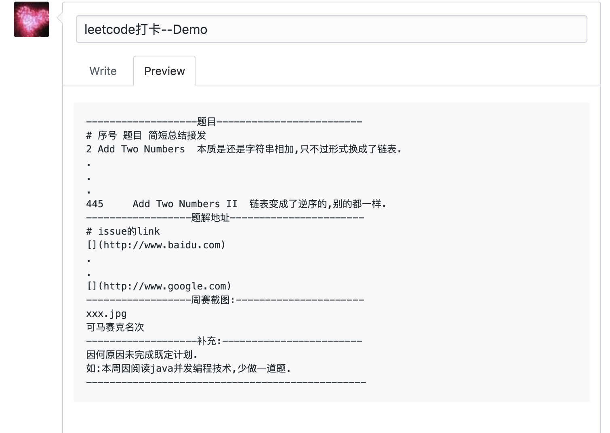

# leetcode-week-attendance
> leetcode群学习打卡,坚持就是胜利

## 加群方式

open一个issue留下微信号和刷题截图.邀请进群.

纯公益坚持自我提升群.

##  打卡规则

以下规则,最低满足一条:

1. 一周最低2道,起码一道medium,时间充足建议,一周5道-10道.
2. 参加leet的周赛
3. 写刷过的题的题解

## 统计方式

### 频率

**每一周**统计一次.

### 方式

open issue到本项目.每一周会统一查看,关闭.

### 格式


**Title** : leetcode打卡-微信群昵称

**Content:**

复制以下模版,注意有```

```shell
`-------------------题目-------------------------`
`序号 题目 简短总结`
2 Add Two Numbers  本质是还是字符串相加,只不过形式换成了链表.
445 Add Two Numbers II  链表变成了逆序的,别的都一样.
`------------------题解地址-----------------------`
`issue的link`
[Add Two Numbers](http://www.baidu.com)
[Add Two Numbers ||](http://www.google.com)
`------------------周赛截图:----------------------`
xxx.jpg
可马赛克名次
`-------------------补充:------------------------`
因何原因未完成既定计划.
如:本周因阅读java并发编程技术,少做一道题.
`------------------------------------------------`
```

题目,题解地址,周赛截图(可马赛克名次)可任选一条或多条满足.




## 刷题建议:

https://juejin.im/post/5d1c6aca6fb9a07ed064cdd5#heading-9

## 国际版企业题库:

http://leetcode.liangjiateng.cn/leetcode/algorithm?difficulty=1


