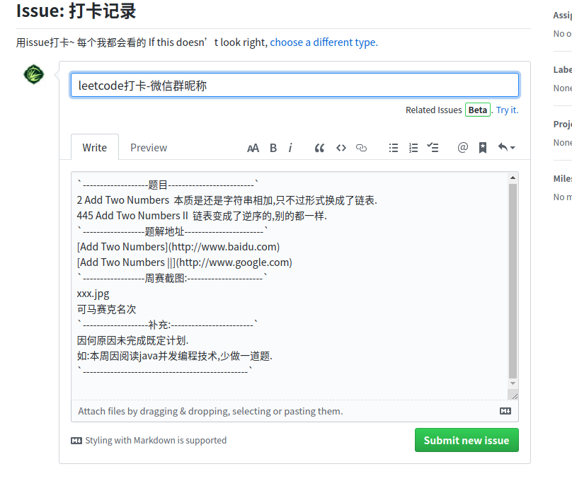

# leetcode-week-attendance
> leetcode群学习打卡,坚持就是胜利

## 加群方式

open一个issue留下微信号和刷题截图.邀请进群.

纯公益坚持自我提升群.

##  打卡规则

以下规则,最低满足一条:

1. 一周最低2道,起码一道medium,时间充足建议,一周5道-10道.
2. 参加leet的周赛
3. 写刷过的题的题解

## 统计方式

### 频率

**每一周**统计一次.

### 方式

open issue到本项目.每一周会统一查看,关闭.

### 格式

已设置issue模板,直接修改即可

## 刷题建议:

https://juejin.im/post/5d1c6aca6fb9a07ed064cdd5#heading-9

## 国际版企业题库:

http://leetcode.liangjiateng.cn/leetcode/algorithm?difficulty=1

