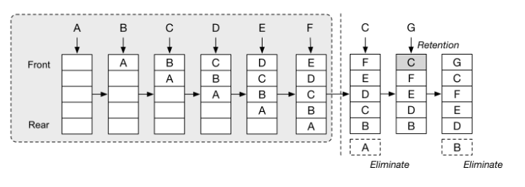

## 推荐题目


这次来推荐一类题目,LRU缓存和LFU缓存的实现，这两个问题在面试很常见。

| 题目             |                    |              |
| ---------------- | ------------------ | ------------ |
| `146. LRU Cache` | `146. LRU缓存机制` | 最近最少使用 |
| `60. LFU Cache`  | `60. LFU 缓存机制` | 最不经常使用 |


## LRU

首先可以了解下LRU缓存的概念

LRU：

- 在达到容量的情况下，继续插入元素则移除最近最久未使用的元素，再把要插入的元素插入到队列头。
- 在LRU查询、更新元素值的情况下，要将此元素移动到队列头。




这其实可以用一个双向链表+HashMap实现，O(1)的时间复杂度

> 注意,一个双向链表+HashMap其实就是java集合中的LinkedHasMap，使用链表把map中的元素，按一定顺序串联起来。
>
> 这道题我们当然也可以用LinkedHasMap。代码只有几行，不过自己实现可以更好地展现基本功。


**下面的代码基本是自解释的，只是有点长**

**双向链表元素**

```java
class ListNode {
    int key, val;
    ListNode prev, next;

    ListNode(int key, int val) {
        this.key = key;
        this.val = val;
    }
}
```

**双向链表**

```java
class DoublyLinkedList {
    ListNode head, tail;
    int size = 0;

    DoublyLinkedList() {
        head = new ListNode(0, 0);
        tail = new ListNode(0, 0);
        head.next = tail;
        tail.prev = head;
    }

    void addToHead(ListNode listNode) {
        listNode.prev = head;
        listNode.next = head.next;
        head.next = listNode;
        listNode.next.prev = listNode;
        size++;
    }

    void remove(ListNode listNode) {
        listNode.prev.next = listNode.next;
        listNode.next.prev = listNode.prev;
        size--;
    }

    ListNode removeLast() {
        if (size > 0) {
            ListNode listNode = tail.prev;
            remove(listNode);
            return listNode;
        } else return null;
    }
}
```

**LRU实现**

使用一个hashmap和双向链表

```java
public class LRUCache {
    DoublyLinkedList DLList;
    int capacity;
    Map<Integer, ListNode> cache;

    public LRUCache(int capacity) {
        cache = new HashMap<>();
        this.DLList = new DoublyLinkedList();
        this.capacity = capacity;
    }

    public int get(int key) {
        if (!cache.containsKey(key)) {
            return -1;
        } else {
            ListNode node = cache.get(key);
            DLList.remove(node);
            DLList.addToHead(node);
            return node.val;
        }
    }

    public void put(int key, int value) {
        if (!cache.containsKey(key)) {
            if (cache.size() >= capacity) {
                ListNode toRemove = DLList.tail.prev;
                DLList.remove(toRemove);
                cache.remove(toRemove.key);
            }
            ListNode newNode = new ListNode(key, value);
            DLList.addToHead(newNode);
            cache.put(key, newNode);
        } else {
            ListNode node = cache.get(key);
            node.val = value;
            DLList.remove(node);
            DLList.addToHead(node);
        }
    }

}
```


## LFU

LFU实际也就是最少使用，将元素按使用次数（查询，更新值都算一次使用）排列。

到达容量则移除被使用次数最少的，好插入新的元素。


我们只需要稍微改一下上面的双向链表元素类

增加一个cnt代表这个元素被访问的次数。

```java
class Node {
        int key, val;
        Node prev, next;
        int cnt;

        Node(int key, int val) {
            this.key = key;
            this.val = val;
            cnt = 1;
        }
    }
```

可以继续使用上面的双向链表。

当然这次我们是使用两个hashmap，一个map存储所有元素，一个map存储多条链表。

可以类比操作系统的进程队列，根据进程状态的不同，有就绪，挂起等多个队列。

我们这里按照被访问的次数，将元素划分到不同的链表。

一个元素被操作，则把它的cnt+1，从一个队列移动到另一个队列。

到达容量，则从访问次数最小的队列中，移除末尾元素。


复用了实现LRU使用到的两个类。

```java
package leetcode.design;

import java.util.HashMap;
import java.util.Map;


public class LFUCache {
    class Node {
        int key, val;
        Node prev, next;
        int cnt;

        Node(int key, int val) {
            this.key = key;
            this.val = val;
            cnt = 1;
        }
    }

    class DoublyLinkedList {
        Node head, tail;
        int size;

        DoublyLinkedList() {
            head = new Node(0, 0);
            tail = new Node(0, 0);
            head.next = tail;
            tail.prev = head;
        }

        void addToHead(Node node) {
            node.prev = head;
            node.next = head.next;
            head.next = node;
            node.next.prev = node;
            size++;
        }

        void remove(Node node) {
            node.prev.next = node.next;
            node.next.prev = node.prev;
            size--;
        }

    
    }

    int capacity, min;
    Map<Integer, Node> nodeMap;
    Map<Integer, DoublyLinkedList> countMap;

    public LFUCache(int capacity) {
        this.capacity = capacity;
        nodeMap = new HashMap<>();
        countMap = new HashMap<>();
    }

    public int get(int key) {
        Node node = nodeMap.get(key);
        if (node == null) return -1;
        update(node);
        return node.val;
    }

    public void put(int key, int value) {
        if (capacity == 0) return;
        Node node;
        if (nodeMap.containsKey(key)) {
            node = nodeMap.get(key);
            node.val = value;
            update(node);
        } else {

            if (nodeMap.size() == capacity) {
                DoublyLinkedList lastList = countMap.get(min);
                nodeMap.remove(lastList.tail.prev.key);
                lastList.remove(lastList.tail.prev);
            }

            node = new Node(key, value);
            nodeMap.put(key, node);

            min = 1;
            DoublyLinkedList newList = countMap.getOrDefault(node.cnt, new DoublyLinkedList());
            newList.addToHead(node);
            countMap.put(node.cnt, newList);
        }
    }

    private void update(Node node) {
        DoublyLinkedList oldList = countMap.get(node.cnt);
        oldList.remove(node);
        if (node.cnt == min && oldList.size == 0) min++;
        node.cnt++;
        DoublyLinkedList newList = countMap.getOrDefault(node.cnt, new DoublyLinkedList());
        newList.addToHead(node);
        countMap.put(node.cnt, newList);
    }


}

```

